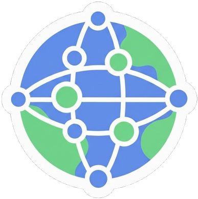

<a id="readme-top"></a>

<br/>

<div align="center">
  <p align="center">
    
    <h3 align="center">Discord Message Proxy</h3>
    <p align="center">
      A self-hosted, real-time web dashboard for interacting with Discord channels through a bot.
      <br />
      <br />
      <a href="https://github.com/aditsuru-git/discord-message-proxy/issues/new?labels=bug&template=bug-report.md">Report Bug</a>
      ·
      <a href="https://github.com/aditsuru-git/discord-message-proxy/issues/new?labels=enhancement&template=feature-request.md">Request Feature</a>
    </p>
  </p>
</div>

<div align="center">

[![Contributors][contributors-shield]][contributors-url]
[![Forks][forks-shield]][forks-url]
[![Stargazers][stars-shield]][stars-url]
[![Issues][issues-shield]][issues-url]
[![MIT License][license-shield]][license-url]
[![Last Commit][last-commit-shield]][last-commit-url]

</div>

<!-- TABLE OF CONTENTS -->
<details>
  <summary>Table of Contents</summary>
  <ol>
    <li>
      <a href="#about-the-project">About The Project</a>
      <ul>
        <li><a href="#built-with">Built With</a></li>
      </ul>
    </li>
    <li>
      <a href="#getting-started">Getting Started</a>
      <ul>
        <li><a href="#prerequisites">Prerequisites</a></li>
        <li><a href="#installation">Installation</a></li>
      </ul>
    </li>
    <li><a href="#usage">Usage</a></li>
    <li><a href="#configuration">Configuration</a></li>
    <li><a href="#license">License</a></li>
    <li><a href="#acknowledgments">Acknowledgments</a></li>
  </ol>
</details>

<!-- ABOUT THE PROJECT -->

## About The Project

This project provides a web-based dashboard that acts as a proxy for a Discord bot. It allows a user to view guilds, browse channels, and interact with messages in real-time through a clean, Discord-like user interface. All interactions—sending messages, replying, reacting, editing, and deleting—are performed by the bot on the user's behalf.

The entire application is containerized with Docker for easy setup and deployment, featuring a multi-stage build process to create a lightweight and secure production image.

### Built With

[![React][react-shield]][react-url]
[![Redux][redux-shield]][redux-url]
[![NodeJS][nodejs-shield]][nodejs-url]
[![Express][express-shield]][express-url]
[![SocketIO][socketio-shield]][socketio-url]
[![TypeScript][typescript-shield]][typescript-url]
[![Docker][docker-shield]][docker-url]

<!-- GETTING STARTED -->

## Getting Started

To get a local instance up and running, follow these steps.

### Prerequisites

You will need the following software and credentials before starting.

- [Node.js](https://nodejs.org/) (v18+)
- [Docker](https://www.docker.com/products/docker-desktop/) and Docker Compose
- A **Discord Bot Token**. You can create an application and get a token from the [Discord Developer Portal](https://discord.com/developers/applications). Your bot will need the following intents enabled:
  - `Guilds`
  - `GuildMessages`
  - `MessageContent`
  - `GuildMessageReactions`

### Installation

1.  Clone the repository:
    ```bash
    git clone https://github.com/aditsuru-git/discord-message-proxy.git
    cd discord-message-proxy
    ```
2.  Create a `.env` file from the sample. This file will hold your secret token.
    ```bash
    cp .env.sample .env
    ```
3.  Edit the `.env` file and add your Discord bot token:
    ```env
    # The Discord bot's authentication token
    DISCORD_BOT_TOKEN=YOUR_DISCORD_BOT_TOKEN_HERE
    ```
4.  Build and run the application using Docker Compose. The `-d` flag runs the container in detached mode (in the background).
    ```bash
    docker compose up --build -d
    ```
    The web dashboard will be available at `http://localhost:3000`.

<!-- USAGE EXAMPLES -->

## Usage

Once the application is running, open your web browser to `http://localhost:3000`. The interface allows you to select a server (guild) from the left-most panel, choose a channel, and view/interact with messages in real-time.

<div align="center">
  
</div>

### Features

- **Real-Time Dashboard**: A clean, responsive UI for interacting with Discord channels.
- **Guild & Channel Navigation**: Browse all servers and text channels your bot has access to.
- **Full Message CRUD**:
  - Send and reply to messages.
  - Edit and delete messages sent by the bot.
- **Reaction Support**: Add or remove reactions on any message as the bot.
- **Event-Driven Backend**: Uses Socket.IO for efficient, real-time communication between the frontend and the Discord bot.
- **Containerized**: Fully configured with Docker and Docker Compose for a simple, one-command setup.

## Configuration

The application's behavior can be modified through the `.env` file. The primary variable you must set is the `DISCORD_BOT_TOKEN`.

| Variable            | Description                                     | Default                 |
| :------------------ | :---------------------------------------------- | :---------------------- |
| `PORT`              | The port the backend server will run on.        | `3000`                  |
| `NODE_ENV`          | The Node.js environment.                        | `development`           |
| `FRONTEND_URL`      | The URL of the frontend (for CORS in dev mode). | `http://localhost:5173` |
| `DISCORD_BOT_TOKEN` | **Required.** Your Discord bot's secret token.  | `null`                  |

<!-- LICENSE -->

## License

Distributed under the **MIT License**. See `LICENSE` for more information.

<!-- ACKNOWLEDGMENTS -->

## Acknowledgments

This project relies on these fantastic open-source libraries and services.

- [Discord.js](https://discord.js.org/)
- [React](https://reactjs.org/) & [Redux Toolkit](https://redux-toolkit.js.org/)
- [Express.js](https://expressjs.com/)
- [Socket.IO](https://socket.io/)
- [Docker](https://www.docker.com/)

<p align="right">(<a href="#readme-top">back to top</a>)</p>

<!-- MARKDOWN LINKS & IMAGES -->

[contributors-shield]: https://img.shields.io/github/contributors/aditsuru-git/discord-message-proxy
[contributors-url]: https://github.com/aditsuru-git/discord-message-proxy/graphs/contributors
[forks-shield]: https://img.shields.io/github/forks/aditsuru-git/discord-message-proxy
[forks-url]: https://github.com/aditsuru-git/discord-message-proxy/network/members
[stars-shield]: https://img.shields.io/github/stars/aditsuru-git/discord-message-proxy
[stars-url]: https://github.com/aditsuru-git/discord-message-proxy/stargazers
[issues-shield]: https://img.shields.io/github/issues/aditsuru-git/discord-message-proxy
[issues-url]: https://github.com/aditsuru-git/discord-message-proxy/issues
[license-shield]: https://img.shields.io/github/license/aditsuru-git/discord-message-proxy
[license-url]: https://github.com/aditsuru-git/discord-message-proxy/blob/main/LICENSE
[last-commit-shield]: https://img.shields.io/github/last-commit/aditsuru-git/discord-message-proxy
[last-commit-url]: https://github.com/aditsuru-git/discord-message-proxy/commits/main

<!-- TECH STACK BADGES -->

[react-shield]: https://img.shields.io/badge/React-20232A?style=for-the-badge&logo=react&logoColor=61DAFB
[react-url]: https://reactjs.org/
[redux-shield]: https://img.shields.io/badge/Redux-593D88?style=for-the-badge&logo=redux&logoColor=white
[redux-url]: https://redux.js.org/
[nodejs-shield]: https://img.shields.io/badge/Node.js-339933?style=for-the-badge&logo=nodedotjs&logoColor=white
[nodejs-url]: https://nodejs.org/
[express-shield]: https://img.shields.io/badge/Express.js-000000?style=for-the-badge&logo=express&logoColor=white
[express-url]: https://expressjs.com/
[socketio-shield]: https://img.shields.io/badge/Socket.io-010101?&style=for-the-badge&logo=socketdotio&logoColor=white
[socketio-url]: https://socket.io/
[typescript-shield]: https://img.shields.io/badge/TypeScript-3178C6?style=for-the-badge&logo=typescript&logoColor=white
[typescript-url]: https://www.typescriptlang.org/
[docker-shield]: https://img.shields.io/badge/Docker-2496ED?style=for-the-badge&logo=docker&logoColor=white
[docker-url]: https://www.docker.com/
